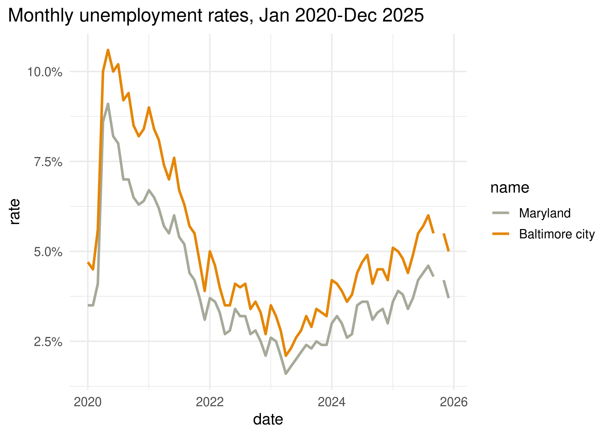
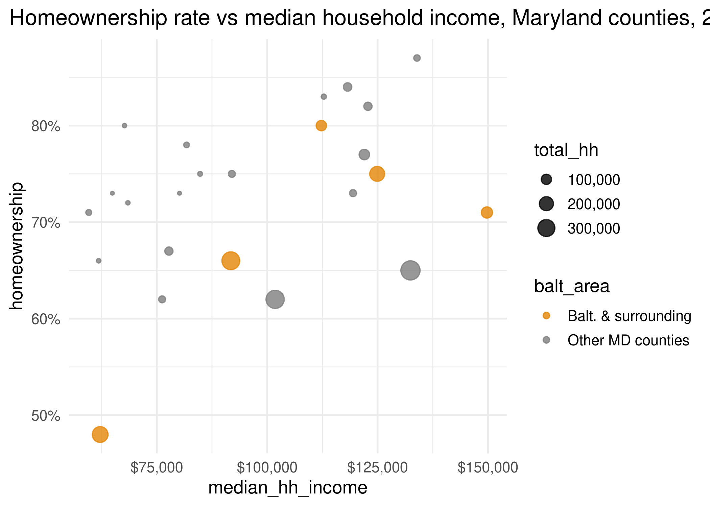
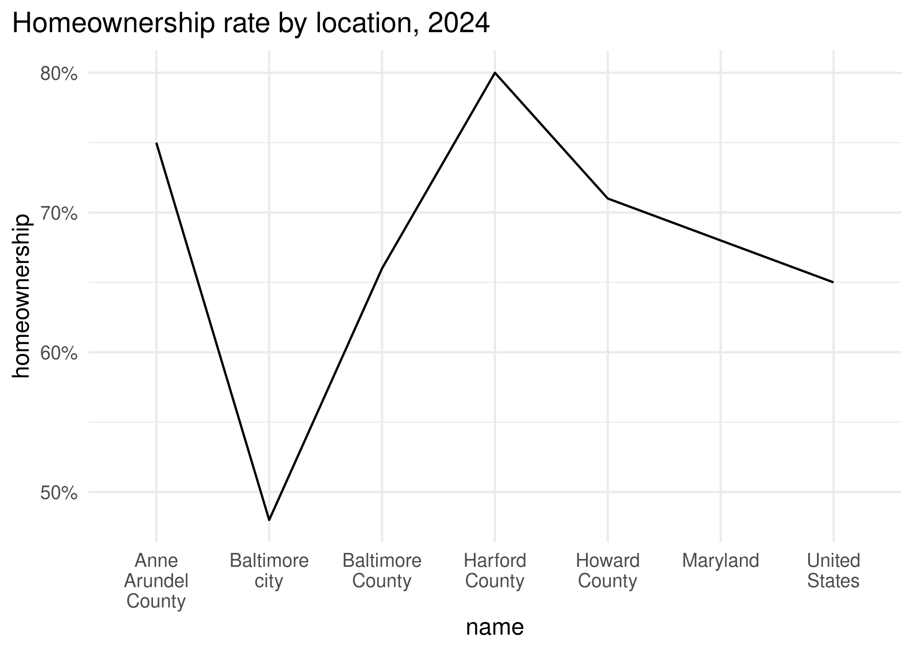

In this lab, we'll practice properly mapping data onto visual encodings. First, you'll take notes on the encodings used in several charts. Then you'll edit code to improve or correct some encodings.

Some references to use with this lab:

* Wilke's book, chapters [2](https://clauswilke.com/dataviz/aesthetic-mapping.html) and [17](https://clauswilke.com/dataviz/proportional-ink.html)
* Munzner's chart of visual encoding rankings [on the course notes site](https://umbc-viz.github.io/ges778/extras/encodings.html)
* The [ggplot2 documentation](https://ggplot2.tidyverse.org)

## Identifying encodings

For each chart, jot down the following:

- Type of chart
- All major encodings (x- and y-axes, size, color, shape, etc.)
- What encoding your brain _primarily_ reads to understand the data (lightness, position, length, etc.)
- What pattern is highlighted by this type of chart (distribution, absolute amounts, relative amounts, etc.)
- Any markings that guide you in reading the chart
- Anything that is not essential to understanding the chart (i.e. "chart junk")

### Chart 1


_Fill in notes here_
#Type of chart: vertical bar chart
#Major encodings:length, categorical x axis, numeric y axis
#Encodings+highlighted patterns:Brain primarily reads the lengths of the bars to understand both the absolute amount represented by each bar and the difference in value between each bar/category (relative amount)
#Markings:The axis titles and categorical and incremental labels help you understand what data is being displayed. The grid in the background helps you identify homeownership values and gauge the height of thr bars. The title describes the data reprsented.
#Chart junk:Having a bar for the US and MD could be confusing if you want to focus on the comparison of homeownership in MD counties. Perhaps these broader, more regional values could be represented by horizontal lines on the graph but this could make the visualization too busy.

### Chart 2


_Fill in notes here_
#Type of chart: horizontal bar chart
#Major encodings:length, numeric x axis, categorical y axis
#Encodings+highlighted patterns:Brain primarily reads the lengths of the bars to understand both the absolute amount represented by each bar and the difference in value between each bar/category (relative amount)
#Markings:The axis titles and categorical and incremental labels help you understand what data is being displayed. The grid in the background helps you identify homeownership values and gauge the length of the bars. The title describes the data represented.
#Chart junk: Again, having a bar for the US and MD could be confusing if you want to focus on the comparison of homeownership in MD counties. Also, the order of the name categories could be confusing since the larger geographies of United States and Maryland are intermingled with the counties.

### Chart 3


_Fill in notes here_
#Type of chart: dot plot
#Major encodings:position, numeric x axis, categorical y axis
#Encodings+highlighted patterns:Brain primarily reads the position of the dots along the x-axis to discern the relative amount of each category. You can estimate each dot's absolute value but not precisely since there are limited increments on the x axis.
#Markings:The axis titles and categorical and incremental labels help you understand what data is being displayed. The grid in the background helps you identify homeownership values and gauge the position of the dots. The title describes the data represented.
#Chart Junk:There is not any major chart junk to identify, however, perhaps the different geographies could be double-encoded with colors. Also, perhaps the x axis scale could be extended on the left to 40% so that the value of Baltimore city homeownership could be more clear.

### Chart 4


_Fill in notes here_
#Type of chart:boxplot
#Major encodings:length, position, direction, numeric x axis, categorical y axis
#Encodings+highlighted patterns:The brain primarily reads the length of the box and its whiskers to get an idea of the data's distribution. The position of the box,whiskers, percentile lines, and outliers tells you values represented in each category's distribution allowing for comparison of categories and the absolute values of key points in the distribution (i.e outliers, percentiles) 
#Markings:The axis titles and categorical and incremental labels help you understand what data is being displayed. The grid in the background helps you gauge the postion of other markings so that you can interpret the homeownership values distributions. Other markings include the horizontal whisker lines, the rectangular box encompasing the majority of the data, the vertical lines representing percentiles, and the dots representing outliers. The title describes the data represented.
#Chart Junk: There is an error in the chart titel, the titel says census tracts but the geographies represented in the data are counties.
### Chart 5



_Fill in notes here_
#Type of chart:Line graph
#Major encodings:slope, time on x axis, numeric y axis, color
#Encodings+highlighted patterns:The brain primarily reads the slope of the lines to assess change in the numeric variable over time
#Markings:The axis titles and labels help you understand what data is being displayed. The grid in the background helps you guage the change in the mumeric variable along the line. The title describes the data represented. The color of each line corresponds to a different geography and allows you to compare the two.
#Chart Junk:The x axis title of "date" is unecessary since the year labels make it obvious that the x axis represents time.

### Chart 6


_Fill in notes here_
#Type of chart:areal line chart
#Major encodings:slope,area, time on x axis, numeric y axis
#Encodings+highlighted patterns:The brain primarily reads the slope of the lines and change in area shaded under the line to assess change in the numeric variable over time
#Markings:The axis titles and labels help you understand what data is being displayed. The grid in the background helps you guage the change over time in the mumeric variable along the line. The title describes the data represented.
#Chart Junk: The x axis title of "date" is unecessary since the year labels make it obvious that the x axis represents time.

### Chart 7



_Fill in notes here_
#Type of chart: bubble chart
#Major encodings:postion, area, numeric x and y axes, color
#Encodings+highlighted patterns:The position of the bubbles in the chart allows the brain to interpret the relationshiop between the x and y variables.Color represents the different categories and the bubble area represents total households. The chart is essentially a scatterplot but the bubble area and color integrate more info.
#Markings:The axis titles and labels help you understand what data is being displayed. The grid in the background helps you guage the position of the bubbles to interpret the relationship between the variables. The title describes the data represented and the 2 legends assist interpretation of the bubble colors and area.
#Chart Junk: The labeling of the 2 household variables could be more clear to better describe what each value is. The category color legend could probably due without a titel since the labels of the categories are self-explanatory.


## Correcting encodings

For each of these charts, write down what is wrong with the encodings. Then edit the code to correct it.

```{r}
#| label: setup
library(dplyr)
library(ggplot2)

# set a default theme
theme_set(
    theme_minimal(base_size = 13) + theme(plot.title.position = "plot")
)

# pull a carto color palette
qual_pal <- rcartocolor::carto_pal(name = "Vivid")

# for convenience, filter just main locations
acs_balt <- justviz::acs |>
    filter(
        name %in%
            c(
                "United States",
                "Maryland",
                "Baltimore city",
                "Baltimore County",
                "Anne Arundel County",
                "Harford County",
                "Howard County"
            )
    )
```

### Chart 8



_Fill in notes here_
#The line connecting points implies contiuous values between the 2 counties and this doesn't make sense for categorical data. Also, the zoomed in scale of the numeric y axis exaggerates differences in values and perhaps the geographies on the x-axis could be ordered in a meaingful way. A bar or dot chart could better represent the values being compared between categories.


```{r}
#| label: chart-8-correction
# Hint: ggplot has some guardrails to keep you from making bad charts
# I needed to add a dummy variable to get around that
acs_balt |>
    mutate(datasource = "acs") |>
    ggplot(aes(x = name, y = homeownership, group = datasource)) +
    geom_col() +
    scale_x_discrete(labels = scales::label_wrap(10)) +
    scale_y_continuous(labels = scales::label_percent()) +
    labs(title = "Homeownership rate by location, 2024")
```

### Chart 9


_Fill in notes here_
#areas of the bubbles does not scale coorectly with the data values. The bubble size represetning 300k total_hh is massively larger than the step before it. The data value is encoded to the bubble radius and not the bubble area, leading to bubble size increasing drastically per step, consequently distorting the visual interpretation of the data. Need to adjust so that bubble area changes with data value, not bubble radius.

```{r}
#| label: chart-9-correction
# Hint: compare to chart 7
#scale_size scales area to value, scale_radius scales radius
justviz::acs |>
    filter(level == "county") |>
    ggplot(aes(x = median_hh_income, y = homeownership, size = total_hh)) +
    geom_point(alpha = 0.8) +
    scale_size(labels = scales::label_comma(),range = c(1, 10)) +
    scale_x_continuous(labels = scales::label_currency()) +
    scale_y_continuous(labels = scales::label_percent()) +
    labs(
        title = "Homeownership rate vs median household income, Maryland counties, 2024"
    )
```

### Chart 10


_Fill in notes here_
#Stacking the bars for each category implies that the 2 categories accumulate to a meaningful total, however, the housing cost burden rate value for each category is unrelated to the other and do not accumulate to a meaningful sum, so this stacking of bars is misleading. 
```{r}
#| label: chart-10-correction
# reshape data to use color
# someone please remind Camille to go over this

#position = position_dodge puts bars next to each other, dodge2 puts a small space between the bars of the same x axis category
cost_burden <- acs_balt |>
    select(name, owner_cost_burden, renter_cost_burden) |>
    tidyr::pivot_longer(
        -name,
        names_to = c("tenure", ".value"),
        names_pattern = "(^[a-z]+)_(\\w+$)",
        names_ptypes = list(tenure = factor())
    )

ggplot(cost_burden, aes(x = name, y = cost_burden, fill = tenure)) +
    geom_col(width = 0.8, position = position_dodge2()) +
    scale_fill_manual(values = qual_pal[c(1, 2)]) +
    scale_x_discrete(labels = scales::label_wrap(10)) +
    scale_y_continuous(labels = scales::label_percent()) +
    labs(title = "Housing cost burden rate by tenure, 2024")
```

